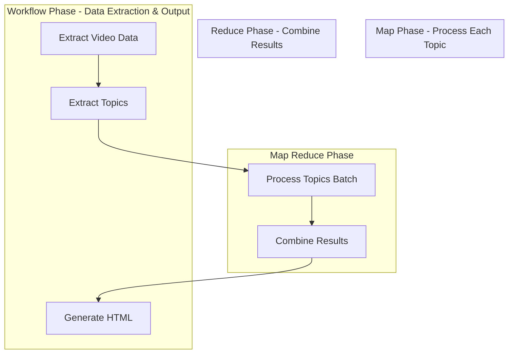

# Design Doc: YouTube Video Summarizer

> Please DON'T remove notes for AI

## Requirements

> Notes for AI: Keep it simple and clear.
> If the requirements are abstract, write concrete user stories

### User Stories

1. **As a user**, I want to input a YouTube video URL and get a comprehensive summary with interesting topics
2. **As a user**, I want to see Q&A pairs for each topic to better understand the content
3. **As a user**, I want explanations written in a friendly, accessible manner that anyone can understand
4. **As a user**, I want to view the summary in a beautiful HTML page that I can easily share or save

### Functional Requirements

- **Input**: YouTube video URL (e.g., https://www.youtube.com/watch?v=VIDEO_ID)
- **Output**: HTML page with:
  - Video title and metadata
  - List of interesting topics extracted from the video
  - Q&A pairs for each topic
  - Friendly explanations of all topics
  - Clean, responsive design

### Technical Requirements

- Extract transcript directly from YouTube video (using existing captions)
- Use LLM to identify interesting topics from full transcript
- Generate Q&A pairs for each topic
- Create friendly explanations
- Generate HTML visualization

## Flow Design

> Notes for AI:
>
> 1. Consider the design patterns of agent, map-reduce, rag, and workflow. Apply them if they fit.
> 2. Present a concise, high-level description of the workflow.

### Applicable Design Pattern:

**Map Reduce Pattern** - This is perfect for processing multiple topics in parallel. The Map Phase processes each topic individually to generate Q&A pairs and explanations, while the Reduce Phase combines all topic results into a final HTML summary.

1. **Map Phase**: Process each topic individually to generate Q&A pairs and explanations
2. **Reduce Phase**: Combine all topic results into a final HTML summary

**Workflow Pattern** - Sequential workflow for initial data extraction and final assembly:

1. Extract video metadata and transcript
2. Identify topics from transcript
3. Map: Process each topic individually (Q&A + explanations) using BatchNode
4. Reduce: Combine all topic results into structured data
5. Generate HTML visualization

### Flow high-level Design:

1. **ExtractVideoData Node**: Get video metadata and transcript from YouTube URL
2. **ExtractTopics Node**: Use LLM to identify interesting topics from transcript
3. **ProcessTopicsBatch Node**: Map each topic individually to generate Q&A pairs and explanations (BatchNode)
4. **CombineResults Node**: Reduce all topic results into a unified summary structure
5. **GenerateHTML Node**: Create beautiful HTML page with all the data



## Utility Functions

> Notes for AI:
>
> 1. Understand the utility function definition thoroughly by reviewing the doc.
> 2. Include only the necessary utility functions, based on nodes in the flow.

**Call LLM** (`utils/call_llm.py`) - Takes a prompt string as input and returns a response string. Generally used by most nodes for LLM tasks.

- _Input_: prompt (str)
- _Output_: response (str)
- Generally used by most nodes for LLM tasks

**Generate HTML** (`utils/html_generator.py`) - Takes summary data dictionary as input and returns HTML file path string. Creates a beautiful HTML page with the video summary.

- _Input_: YouTube URL (str)
- _Output_: transcript text (str)
- Extracts existing captions/transcripts from YouTube video using yt-dlp

3. **Generate HTML** (`utils/html_generator.py`)

   - _Input_: summary data (dict)
   - _Output_: HTML file path (str)
   - Creates a beautiful HTML page with the video summary

4. **Get Video Metadata** (`utils/youtube_metadata.py`)
   - _Input_: YouTube URL (str)
   - _Output_: video metadata (dict) with title, description, duration, etc.

## Node Design

### Shared Store

> Notes for AI: Try to minimize data redundancy

The shared store structure is organized as follows:

```python
shared = {
    "youtube_url": "https://www.youtube.com/watch?v=VIDEO_ID",
    "video_metadata": {
        "title": "Video Title",
        "duration": 300,
        "uploader": "Channel Name",
        "view_count": 1000,
        "upload_date": "20240101"
    },
    "transcript": "Full transcript text...",
    "topics": ["Topic 1", "Topic 2", "Topic 3"],
    "topic_results": [
        {
            "topic": "Topic 1",
            "qa_pairs": [{"question": "What is topic 1?", "answer": "Answer for topic 1"}],
            "explanation": "Friendly explanation of topic 1..."
        },
        {
            "topic": "Topic 2",
            "qa_pairs": [{"question": "What is topic 2?", "answer": "Answer for topic 2"}],
            "explanation": "Friendly explanation of topic 2..."
        }
    ],
    "combined_summary": {
        "all_qa_pairs": [...],  # Flattened Q&A pairs for HTML generation
        "all_explanations": [...]  # Flattened explanations for HTML generation
    },
    "html_file_path": "/path/to/generated/summary.html"
}
```

### Node Steps

> Notes for AI: Carefully decide whether to use Batch/Async Node/Flow.

**ExtractVideoData Node** - Extracts video metadata and transcript from YouTube URL. This is a Regular Node that reads the "youtube_url" from shared store in prep, calls get_video_metadata() and get_youtube_transcript() utilities in exec, and writes "video_metadata" and "transcript" to shared store in post.

- _Purpose_: Extract video metadata and transcript from YouTube URL
- _Type_: Regular Node
- _Steps_:
  - _prep_: Read "youtube_url" from shared store
  - _exec_: Call get_video_metadata() and get_youtube_transcript() utilities
  - _post_: Write "video_metadata" and "transcript" to shared store

**ExtractTopics Node** - Uses LLM to identify interesting topics from the transcript. This is a Regular Node that reads the "transcript" from shared store in prep, calls LLM with a prompt to extract topics in exec, and writes "topics" list to shared store in post.

- _Purpose_: Use LLM to identify interesting topics from transcript
- _Type_: Regular Node
- _Steps_:
  - _prep_: Read "transcript" from shared store
  - _exec_: Call LLM with prompt to extract topics
  - _post_: Write "topics" list to shared store

**ProcessTopicsBatch Node** - Maps each topic individually to generate Q&A pairs and explanations. This is a Batch Node that reads "topics" list from shared store and returns as iterable in prep, calls LLM to generate Q&A pairs and explanation for each specific topic in exec, and writes "topic_results" list to shared store with structured data per topic in post.

- _Purpose_: Map each topic individually to generate Q&A pairs and explanations
- _Type_: Batch Node
- _Steps_:
  - _prep_: Read "topics" list from shared store, return as iterable
  - _exec_: For each topic, call LLM to generate Q&A pairs and explanation for that specific topic
  - _post_: Write "topic_results" list to shared store with structured data per topic

3. **ProcessTopicsBatch Node**

   - _Purpose_: Map each topic individually to generate Q&A pairs and explanations
   - _Type_: Batch Node
   - _Steps_:
     - _prep_: Read "topics" list from shared store, return as iterable
     - _exec_: For each topic, call LLM to generate Q&A pairs and explanation for that specific topic
     - _post_: Write "topic_results" list to shared store with structured data per topic

4. **CombineResults Node**

   - _Purpose_: Reduce all topic results into a unified summary structure for HTML generation
   - _Type_: Regular Node
   - _Steps_:
     - _prep_: Read "topic_results" from shared store
     - _exec_: Flatten and organize Q&A pairs and explanations for HTML generation
     - _post_: Write "combined_summary" with flattened data structure

5. **GenerateHTML Node**
   - _Purpose_: Create beautiful HTML page with all the summary data
   - _Type_: Regular Node
   - _Steps_:
     - _prep_: Read video_metadata, topics, and combined_summary from shared store
     - _exec_: Call generate_html() utility with structured data
     - _post_: Write "html_file_path" to shared store
